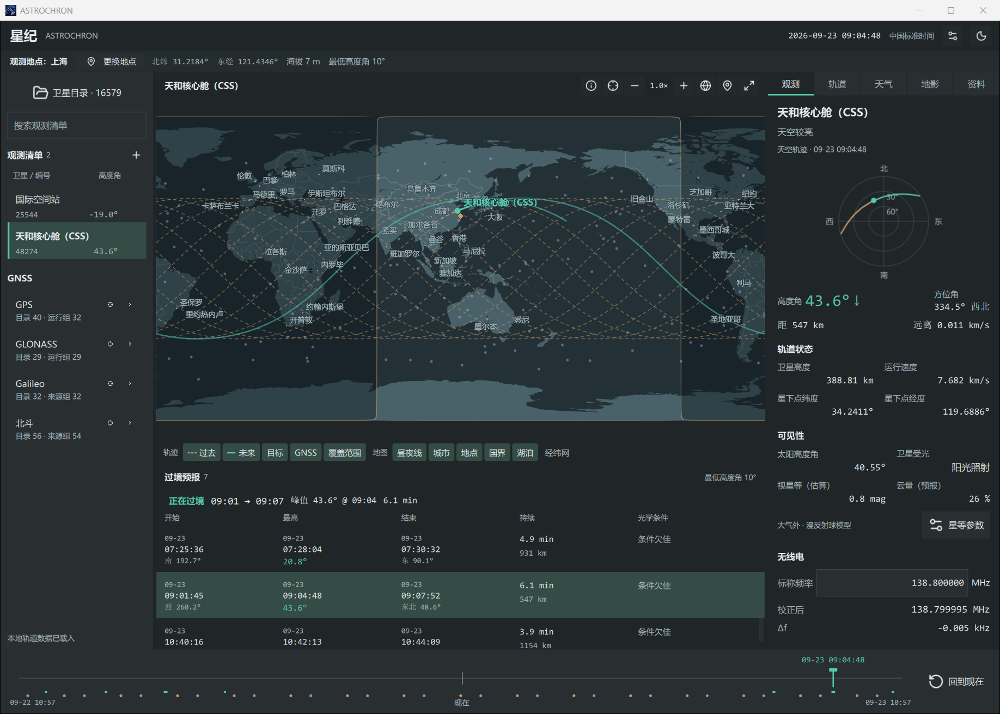

  

<h1 align="center">ASTROCHRON · 星纪</h1>

A desktop application for satellite tracking, pass prediction, and observation planning

<a href="README.md">简体中文</a> | English

## Download

Supports Windows 10 / 11 x64 and Linux x86_64, with a Windows installer, portable ZIP, and Linux AppImage on the [Releases](https://github.com/KaffuAlcaid/ASTROCHRON/releases/latest) page

If using the ZIP, extract the entire archive before running `ASTROCHRON.exe`; if using the AppImage, make the file executable before running it

## Features

- **Satellite tracking**: View satellite positions and tracks on the map and sky chart, and browse position changes within 12 hours before and after the current time
- **Pass predictions**: Predict satellite pass times, maximum elevation, and optical observing conditions for your location
- **Observation plans**: Save frequently observed satellites and export pass plans as CSV tables or ICS calendar files
- **Observation information**: View satellite azimuth, elevation, range, estimated brightness, and local weather, and calculate radio Doppler shift
- **Orbital data**: Retrieve orbital data from CelesTrak or import TLE / OMM files, and save and browse historical orbital data

Available in Simplified Chinese and English

## Quick Start

1. Launch the application, choose an interface language, and set your observing location
2. Retrieve orbital data online or import a TLE / OMM file in "Satellite catalog", then select a satellite to observe
3. Browse the pass predictions and click an entry to view that pass, then drag the timeline to explore changes in the satellite's position

## Documentation

| Document | Contents |
| --- | --- |
| [User Guide](docs/user-guide.en.md) | Installation, updates, observing workflows, and settings |
| [Data Sources](docs/data-sources.en.md) | Data providers, source dates, and local storage |
| [Calculation Notes](docs/calculations.en.md) | Orbit propagation, passes, apparent magnitude, and Doppler calculations |
| [Principles of SGP4 Orbit Propagation](docs/orbit-model.en.md) | Calculating TEME states and local observing directions from mean elements |

## Data and Calculations

Satellite orbital data comes from [CelesTrak](https://celestrak.org/NORAD/elements/), with propagation handled by the Vallado SGP4 implementation for near-Earth and deep-space orbits

Map and city data comes from [Natural Earth](https://www.naturalearthdata.com/), weather and terrain elevation from [Open-Meteo](https://open-meteo.com/), and brightness references from the McCants / QuickSat magnitude catalog and historical photometric observations of the Chinese Space Station

Orbit predictions depend on the age of the orbital data and satellite maneuvers, and past positions on the timeline are also calculated using the model

Actual brightness also varies with satellite attitude, configuration, and atmospheric conditions

## Acknowledgments

Reference project: [ShenMian/tracker](https://github.com/ShenMian/tracker)

Inspired by: *仰望夜空的星辰* (見上げてごらん、夜空の星を)

## License

ASTROCHRON source code is licensed under [Apache-2.0](LICENSE)

See [Third-Party Notices](THIRD_PARTY_NOTICES.en.md) for the licenses and terms of use governing third-party software and data
