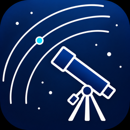
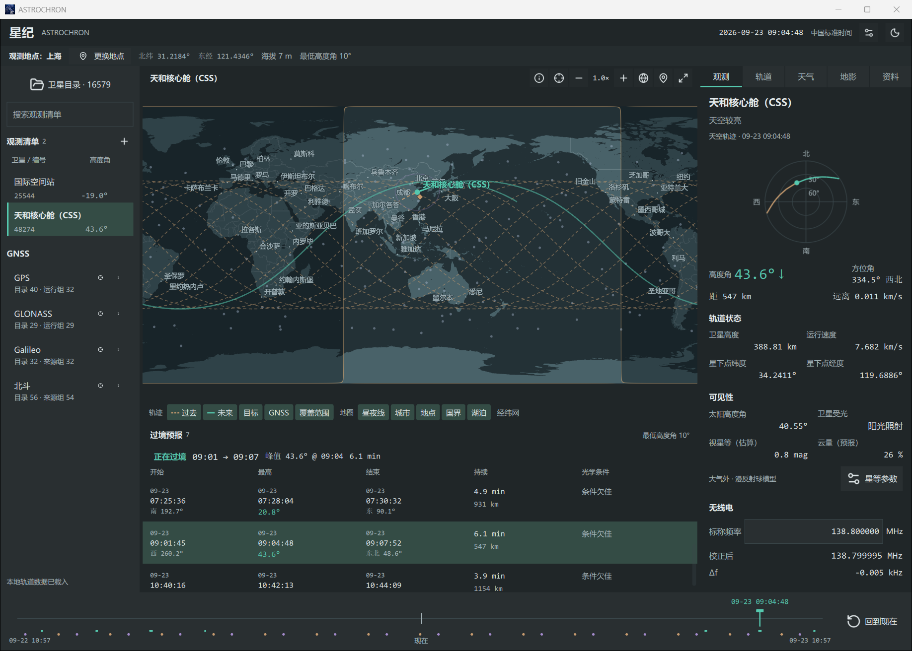

  

<h1 align="center">ASTROCHRON · 星纪</h1>

查看卫星轨迹、推演过境时刻、规划观测的桌面应用

## 功能

- **卫星地图**：查看空间站与 GNSS 位置，缩放、平移或展开地图，自选轨迹、昼夜线、城市和覆盖范围等图层
- **24 h 时间推演**：浏览当前时刻前后各 12 h 的位置，地图、天空图和观测信息随时间联动
- **过境预报**：查看开始、最高点和结束时刻，以及最高高度角、持续时间与光学条件，点击过境即可跳到最高点
- **观测清单**：按需收藏卫星，按星座浏览目录，以名称、NORAD ID 或国际编号查找目标
- **观测信息**：查看方位角、高度角、距离、视星等估算和天气，按接收频率计算多普勒频移
- **轨道资料**：查阅历元、完整轨道根数、数据来源与日期，导入 TLE / OMM 文件，使用本地保存的轨道数据
- **观测地点**：搜索城市、输入经纬度或在地图选点，设置海拔、最低高度角与时区，保存常用地点

## 下载

## 快速使用

1. 解压应用包，运行 `ASTROCHRON.exe`
2. 首次启动时选择观测地点，确认海拔、最低高度角和时区
3. 从观测清单选择空间站，或打开卫星目录勾选其他目标
4. 点击过境预报或拖动时间轴查看目标位置，点击“回到现在”继续实时跟踪

完整步骤见[开始使用](docs/getting-started.md)

## 文档

| 文档 | 内容 |
| --- | --- |
| [开始使用](docs/getting-started.md) | 运行程序、选择地点、查看第一次过境 |
| [使用手册](docs/user-guide.md) | 地图、目录、观测信息、星等、无线电与设置 |
| [数据来源](docs/data-sources.md) | 数据提供方、资料日期、联网查询与本地保存 |
| [计算说明](docs/calculations.md) | 轨道传播、坐标、过境、视星等与多普勒计算 |

## 数据与计算

卫星轨道数据来自 [CelesTrak](https://celestrak.org/NORAD/elements/)，轨道传播采用 Vallado SGP4 实现，包含深空轨道处理，地图与城市来自 [Natural Earth](https://www.naturalearthdata.com/)，天气与地形海拔查询由 [Open-Meteo](https://open-meteo.com/) 提供

视星等使用 McCants / QuickSat 星等表及中国空间站历史测光资料，按距离和相位角估算大气外亮度，支持手动参数与星等表导入

内置 QuickSat 星等表的文件日期为 **2020-09-14**，中国空间站参考资料的报告日期为 **2022-08-03**；公开参考资料核对截至 **2026-09-22**，各项版本与日期见[数据来源](docs/data-sources.md)

应用“资料”页显示当前采用的来源与日期，轨道预测受根数历元与卫星机动影响，实测亮度还受姿态、构型和大气影响，时间轴上的过去位置同样由轨道模型推算

参考项目：[ShenMian/tracker](https://github.com/ShenMian/tracker)
制作灵感来源： 《仰望夜空的星辰》 （見上げてごらん、夜空の星を）

## 许可证

ASTROCHRON 源码采用 [Apache-2.0](LICENSE) 许可

第三方软件与数据遵循各自的许可和使用条款，署名、来源及许可文件位置见[第三方声明](THIRD_PARTY_NOTICES.md)
