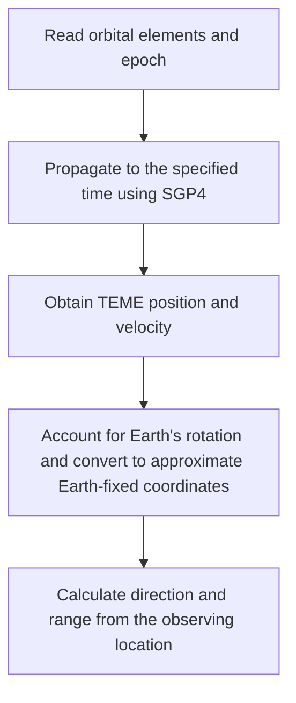

# Principles of SGP4 Orbit Propagation

[简体中文](orbit-model.md) | English

[Home](../README.en.md) · [Calculation Notes](calculations.en.md) · [Data Sources](data-sources.en.md)

SGP4 calculates a satellite's position and velocity at a specified time from a set of orbital elements. ASTROCHRON then combines these with Earth's rotation and the observing location to calculate the map position, azimuth, elevation, and range

ASTROCHRON uses the SGP4 implementation developed by Vallado and colleagues, which includes both near-Earth and deep-space orbit handling[^vallado]. This document introduces the main calculation process. See the original theoretical references for the full model equations, and [Calculation Notes](calculations.en.md) for the definitions and units of displayed values

## What Orbital Elements Describe

The orbital elements in a TLE undergo a specific averaging process. During propagation, SGP4 restores periodic variations according to the corresponding theory, so these data should be used with SGP4[^str3]. Appropriate conversion is required before using them with another orbital model

The CelesTrak GP data read by ASTROCHRON uses the same type of mean elements. TLE and OMM represent these data; OMM can also explicitly record the time system and orbital theory. The application uses UTC time and SGP4 theory[^implementation]

| Parameter | Symbol | Meaning |
| --- | --- | --- |
| Epoch | $`t_0`$ | Reference time of the element set |
| Mean motion | $`n`$ | Basic rate of change of mean anomaly, usually expressed in rev/d by the source |
| Eccentricity | $`e`$ | Degree to which an elliptical orbit deviates from a circle |
| Orbital inclination | $`i`$ | Tilt of the orbital plane relative to the equatorial plane |
| Right ascension of the ascending node | $`\Omega`$ | Angle in the equatorial plane measured eastward from the reference vernal equinox to the orbit's ascending node |
| Argument of perigee | $`\omega`$ | Angle in the orbital plane measured from the ascending node to perigee |
| Mean anomaly | $`M`$ | A uniformly increasing angle representing the satellite's progress along its orbit |
| Drag term | $`B^*`$ | Effective drag parameter obtained by fitting the orbit, usually written as BSTAR |

Propagation uses the difference between the target time and the epoch, $`t-t_0`$. The Vallado implementation accepts this interval in min, calculates angles in rad, and outputs position and velocity in km and km/s, respectively[^implementation]

NORAD ID, COSPAR international designator, and revolution number at epoch identify objects or record orbital information. Mean-motion derivatives are also retained from the source. This SGP4 implementation handles orbital changes caused by drag through $`B^*`$ and model coefficients[^implementation]

## Calculating Position from Mean Elements

### Initialization

In the two-body problem, only Earth's central gravitational attraction is considered, and mean motion and semimajor axis satisfy

$$
a=\left(\frac{\mu}{n^2}\right)^{1/3}
$$

Here, $`\mu`$ is Earth's gravitational parameter. When it is expressed in km³/s², $`n`$ must be converted to rad/s, and the resulting semimajor axis $`a`$ is in km

TLE mean motion also contains corrections under its theoretical conventions. During initialization, SGP4 first recovers mean motion with a correction related to $`J_2`$, then obtains the semimajor axis and subsequent coefficients. Directly substituting TLE values into the equation above gives a result suitable for a preliminary estimate[^vallado][^implementation]

ASTROCHRON initializes orbit propagation with WGS-72 constants, including Earth's gravitational parameter of 398600.8 km³/s² and a reference radius of 6378.135 km. Ground latitude and longitude and observer position instead use the WGS84 ellipsoid; the two serve the orbital model and surface coordinate calculations, respectively[^implementation]

### Earth's Nonspherical Gravity and Drag

Earth bulges slightly near the equator, and its gravity field includes components that depart from spherical symmetry. SGP4 accounts for these effects through terms such as $`J_2`$, $`J_3`$, and $`J_4`$; the orientations of the orbital plane and perigee change slowly over time[^vallado][^implementation]

Taking the dominant $`J_2`$ term as an example and setting $`p=a(1-e^2)`$, the first-order secular rates of change of the right ascension of the ascending node and argument of perigee are

$$
\dot{\Omega}\approx-\frac{3}{2}J_2n\left(\frac{R_E}{p}\right)^2\cos i
$$

$$
\dot{\omega}\approx\frac{3}{4}J_2n\left(\frac{R_E}{p}\right)^2(5\cos^2 i-1)
$$

Here, $`R_E`$ is the orbital model's Earth reference radius, $`J_2`$ is dimensionless, and $`a`$, $`p`$, and $`R_E`$ use the same length unit. When $`n`$ is in rad/s, both angular rates are also in rad/s

These two equations illustrate how the orbit's orientation slowly rotates. The full SGP4 calculation also includes higher-order secular terms, long-period terms, and short-period terms[^implementation]

Atmospheric drag changes the size of a low-Earth orbit and the satellite's along-track position. SGP4 describes this process using $`B^*`$ and corresponding coefficients. $`B^*`$ comes from orbit fitting and may also absorb model errors, so it should be used as part of the element set. On its own, it is insufficient to reliably recover the satellite's actual frontal area or local atmospheric density[^vallado]

### Near-Earth and Deep-Space Branches

The Vallado implementation calculates the orbital period from the mean motion recovered during initialization and uses 225 min as the dividing point[^implementation]

| Period | Treatment | Common objects |
| --- | --- | --- |
| Less than 225 min | Near-Earth branch | Low-orbit targets such as the International Space Station and Chinese Space Station |
| Greater than or equal to 225 min | Deep-space branch, including solar and lunar perturbations and resonance terms where applicable | GNSS satellites such as GPS, Galileo, and BeiDou, and geosynchronous satellites |

Here, deep space is a model classification that applies to some Earth-orbiting satellites. The Vallado implementation combines the original SGP4 and SDP4 treatments in a single program, commonly referred to as SGP4[^vallado]

### Recovering Instantaneous Position and Velocity

After advancing the secular variations to the target time, the model accounts for periodic variations and solves a modified Kepler equation[^implementation]

For a two-body elliptical orbit, this step can be written as

$$
M=E-e\sin E,\qquad r=a(1-e\cos E)
$$

Here, $`E`$ is the eccentric anomaly, and $`r`$ is the distance from the satellite to Earth's center. These equations illustrate how a mean angle yields a position on an ellipse. SGP4 uses a form with perturbation corrections and further corrects radial distance, orbital orientation, and velocity, ultimately outputting position and velocity in the TEME frame[^vallado][^implementation]

TEME stands for True Equator, Mean Equinox. Ground latitude and longitude require subsequent coordinate transformations

## From Geocentric Position to Observing Direction

### Accounting for Earth's Rotation

Let $`\theta`$ be the Greenwich mean sidereal time angle at the target time. ASTROCHRON uses the following rotation to convert TEME position into approximate Earth-fixed coordinates[^implementation]

$$
\mathcal R(\theta)=
\begin{bmatrix}
\cos\theta & \sin\theta & 0 \\
-\sin\theta & \cos\theta & 0 \\
0 & 0 & 1
\end{bmatrix}
$$

$$
\mathbf r_s=\mathcal R(\theta)\mathbf r_{\mathrm{TEME}}
$$

The subscript $`s`$ denotes the satellite. Earth-fixed coordinate axes rotate with Earth, and the velocity transformation must also account for this rotation

$$
\mathbf v_s=\mathcal R(\theta)\mathbf v_{\mathrm{TEME}}
-\boldsymbol\omega_E\times\mathbf r_s
$$

$`\boldsymbol\omega_E`$ is directed along Earth's rotation axis. The application uses an angular speed of approximately $`7.292115\times10^{-5}`$ rad/s. The sidereal-time calculation approximates UT1 as UTC, and the Earth-fixed transformation assumes zero polar motion[^implementation]

The transformed position is used to obtain latitude, longitude, and altitude on the WGS84 ellipsoid. See Appendix C of the Vallado paper for the time systems and polar motion handling involved in rigorous coordinate transformations[^vallado]

### Using the Observing Location as the Origin

The application calculates the observer's Earth-fixed position $`\mathbf r_o`$ from the observing location's latitude, longitude, and ellipsoidal height. The satellite's position vector relative to the observer and its range are

$$
\boldsymbol\rho=\mathbf r_s-\mathbf r_o,\qquad d=\lVert\boldsymbol\rho\rVert
$$

Projecting $`\boldsymbol\rho`$ onto the east, north, and zenith directions at the observing location gives $`\rho_E`$, $`\rho_N`$, and $`\rho_U`$. Azimuth $`A`$ and elevation $`\varepsilon`$ are

$$
A=\mathrm{atan2}(\rho_E,\rho_N)\pmod{2\pi}
$$

$$
\varepsilon=\mathrm{atan2}\left(\rho_U,\sqrt{\rho_E^2+\rho_N^2}\right)
$$

Azimuth increases eastward from true north and is converted to 0–360° for display. Elevation uses the observer's geometric horizon as its zero reference[^implementation]

For an observer fixed to the ground, Earth-fixed velocity is zero, and the range rate can be written as

$$
\dot d=\frac{\boldsymbol\rho\cdot\mathbf v_s}{d}
$$

When $`\dot d`$ is positive, the satellite is receding; when negative, it is approaching. The application uses it to calculate [Doppler shift](calculations.en.md#doppler-shift). Terrain, buildings, and atmospheric refraction affect actual observations, so geometric elevation should be interpreted in conjunction with conditions at the observing site

## Pass Times and Prediction Accuracy

Pass prediction calculates elevation over time, finds where the satellite crosses the minimum elevation, and determines the culmination within that pass. ASTROCHRON refines time searches for the start, end, and culmination to 0.5 s[^implementation]

This value is the search resolution. Differences between predictions and observations also arise from the following factors

- **Element epoch**: The farther the calculation time is from the epoch, the more likely discrepancies between the orbital model and actual motion are to accumulate
- **Satellite maneuvers**: After a space station orbit reboost or a satellite orbit change, elements that reflect the post-maneuver orbit are needed
- **Atmospheric changes**: Drag in low orbit varies with atmospheric conditions and satellite attitude; a fitted parameter set can only approximate these effects
- **Coordinates and location**: Earth rotation approximations, observer position errors, and refraction near the horizon all affect the predicted direction in the sky

The error of an individual pass must be evaluated using the corresponding elements and actual observations. A single time or distance value cannot readily describe all satellites[^vallado]

Calculating positions more frequently provides denser time samples, and increasing the rendering refresh rate makes displayed motion smoother. Orbit predictions themselves remain limited by the elements and model used. Past positions on the timeline are also calculated from the elements; when reviewing historical passes, elements with an epoch close to that time are preferable

## References

[^str3]: Hoots, F. R., and Roehrich, R. L., 1980, *Spacetrack Report No. 3: Models for Propagation of NORAD Element Sets*. Describes mean-element conventions and the original model equations. [CelesTrak documentation](https://celestrak.org/NORAD/documentation/), [full report](https://celestrak.org/NORAD/documentation/spacetrk.pdf)

[^vallado]: Vallado, D. A., Crawford, P., Hujsak, R., and Kelso, T. S., 2006, *Revisiting Spacetrack Report #3*, AIAA 2006-6753. This document refers to Revision 3: Section II discusses the model and input conventions, Section III describes the implementation, Section VII compares results from different implementations, and Appendix C explains coordinate transformations. [Paper and supporting materials](https://celestrak.org/publications/AIAA/2006-6753/), [full Revision 3 paper](https://celestrak.org/publications/AIAA/2006-6753/AIAA-2006-6753-Rev3.pdf)

[^implementation]: ASTROCHRON's specific constants, branches, and formulas correspond to the repository's [Vallado SGP4 implementation](../third_party/sgp4/SGP4.cpp), [orbit and observation calculations](../src/orbit_propagator.cpp), and [pass prediction](../src/pass_predictor.cpp). See [Third-Party Notices](../THIRD_PARTY_NOTICES.en.md) for software and data licenses
