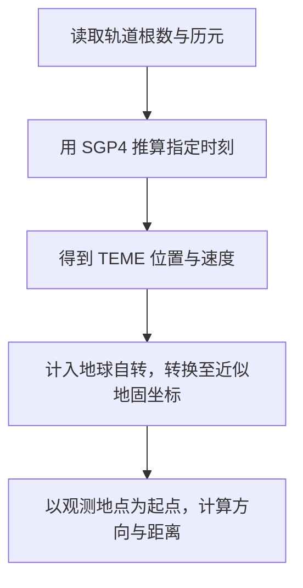

# SGP4 轨道传播原理

[返回首页](../README.md) · [计算说明](calculations.md) · [数据来源](data-sources.md)

SGP4 根据一组轨道根数，推算卫星在指定时刻的位置与速度，ASTROCHRON 再结合地球自转和观测地点，算出地图位置、方位角、高度角与距离

ASTROCHRON 使用 Vallado 等人整理的 SGP4 实现，其中同时包含近地与深空轨道处理[^vallado]，本文介绍主要计算过程，完整模型公式见原始理论资料，显示值的定义与单位见[计算说明](calculations.md)

## 轨道根数描述什么

TLE 中的轨道根数经过特定的平均化处理，SGP4 在传播时按对应理论恢复周期变化，因此这组数据应与 SGP4 配套使用[^str3]，若要交给其他轨道模型继续计算，需要先完成相应转换

ASTROCHRON 读取的 CelesTrak GP 数据采用同一类平均根数，TLE 和 OMM 表达的是这些数据，OMM 还可明确记录时间系统与轨道理论；程序采用 UTC 时间和 SGP4 理论[^implementation]

| 参数 | 符号 | 含义 |
| --- | --- | --- |
| 历元 | $`t_0`$ | 这组根数所对应的参考时刻 |
| 平均运动 | $`n`$ | 平近点角变化的基本速率，来源通常以 rev/d 表示 |
| 偏心率 | $`e`$ | 椭圆轨道偏离圆形的程度 |
| 轨道倾角 | $`i`$ | 轨道面相对赤道面的倾斜程度 |
| 升交点赤经 | $`\Omega`$ | 在赤道面内，从参考春分点向东量至轨道升交点的角度 |
| 近地点幅角 | $`\omega`$ | 沿轨道面从升交点量至近地点的角度 |
| 平近点角 | $`M`$ | 用均匀增加的角度表示卫星在轨道上的进程 |
| 阻力项 | $`B^*`$ | 拟合轨道时得到的有效阻力参数，通常写作 BSTAR |

传播使用目标时刻与历元之差 $`t-t_0`$，Vallado 实现以 min 接收这段时间，以 rad 计算角度，输出的位置与速度分别使用 km 和 km/s[^implementation]

NORAD ID、COSPAR 国际编号和历元圈数用于标识对象或记录轨道资料，平均运动导数也随来源保留；这套 SGP4 通过 $`B^*`$ 及模型系数处理阻力造成的轨道变化[^implementation]

## 从平均根数推算位置

### 初始化

在二体问题中，只考虑地球的中心引力，平均运动与半长轴满足

$$
a=\left(\frac{\mu}{n^2}\right)^{1/3}
$$

其中 $`\mu`$ 为地球引力参数，取 km³/s² 时，$`n`$ 应换算为 rad/s，所得半长轴 $`a`$ 使用 km

TLE 的平均运动还包含其理论约定下的修正，SGP4 初始化时先进行与 $`J_2`$ 有关的平均运动恢复，再求取半长轴和后续系数；上式直接代入 TLE 数值所得的结果适合用作初步估计[^vallado][^implementation]

ASTROCHRON 用 WGS-72 常数初始化轨道传播，其中地球引力参数为 398600.8 km³/s²，参考半径为 6378.135 km；地面经纬度与观测者位置则采用 WGS84 椭球，两者分别服务于轨道模型和地表坐标计算[^implementation]

### 地球非球形引力与阻力

地球在赤道附近略鼓，重力场含有偏离球对称的部分，SGP4 通过 $`J_2`$、$`J_3`$、$`J_4`$ 等项计入这些影响，轨道面和近地点的方向会随时间缓慢变化[^vallado][^implementation]

以最主要的 $`J_2`$ 项为例，令 $`p=a(1-e^2)`$，升交点赤经与近地点幅角的一阶长期变化率为

$$
\dot{\Omega}\approx-\frac{3}{2}J_2n\left(\frac{R_E}{p}\right)^2\cos i
$$

$$
\dot{\omega}\approx\frac{3}{4}J_2n\left(\frac{R_E}{p}\right)^2(5\cos^2 i-1)
$$

这里 $`R_E`$ 为轨道模型的地球参考半径，$`J_2`$ 无量纲，$`a`$、$`p`$ 与 $`R_E`$ 使用相同长度单位；$`n`$ 采用 rad/s 时，两个角速度也使用 rad/s

这两式用于说明轨道方向如何缓慢转动，SGP4 的完整计算还含有更高阶的长期项、长周期项与短周期项[^implementation]

低轨卫星受到大气阻力后，轨道大小和沿轨位置也会变化，SGP4 用 $`B^*`$ 及相应系数描述这一过程；$`B^*`$ 来自轨道拟合，也可能吸收模型误差，因此应作为该组根数的一部分使用，单凭它难以还原卫星的实际迎风面积或当地大气密度[^vallado]

### 近地与深空分支

Vallado 实现按初始化后恢复的平均运动计算轨道周期，以 225 min 为分界[^implementation]

| 周期 | 采用的处理 | 常见对象 |
| --- | --- | --- |
| 小于 225 min | 近地分支 | 国际空间站、中国空间站等低轨目标 |
| 大于或等于 225 min | 深空分支，包含日月摄动，并在符合条件时计算共振项 | GPS、伽利略、北斗等 GNSS 卫星，以及地球同步卫星 |

这里的深空是模型中的分类名称，适用于部分绕地卫星；Vallado 实现将原有 SGP4 与 SDP4 的处理合在同一套程序中，通常统称 SGP4[^vallado]

### 恢复瞬时位置与速度

长期变化推进到目标时刻后，模型继续计入周期变化，并求解经过修正的开普勒方程[^implementation]

在二体椭圆轨道中，这一步可写为

$$
M=E-e\sin E,\qquad r=a(1-e\cos E)
$$

其中 $`E`$ 为偏近点角，$`r`$ 为卫星到地心的距离，这组式子说明如何从平均角度得到椭圆上的位置；SGP4 使用含摄动修正的形式，并继续修正径向距离、轨道方向和速度，最终输出 TEME 坐标系中的位置与速度[^vallado][^implementation]

TEME 指真赤道、平春分点坐标系，地面经纬度还需要通过后续坐标转换求得

## 从地心位置到观测方向

### 计入地球自转

令 $`\theta`$ 为目标时刻的格林尼治平恒星时角，ASTROCHRON 用下列旋转将 TEME 位置转换到近似地固坐标[^implementation]

$$
\mathcal R(\theta)=
\begin{bmatrix}
\cos\theta & \sin\theta & 0 \\
-\sin\theta & \cos\theta & 0 \\
0 & 0 & 1
\end{bmatrix}
$$

$$
\mathbf r_s=\mathcal R(\theta)\mathbf r_{\mathrm{TEME}}
$$

下标 $`s`$ 表示卫星，地固坐标轴随地球转动，速度转换还需计入这部分转动

$$
\mathbf v_s=\mathcal R(\theta)\mathbf v_{\mathrm{TEME}}
-\boldsymbol\omega_E\times\mathbf r_s
$$

$`\boldsymbol\omega_E`$ 沿地球自转轴，程序采用的角速度大小约为 $`7.292115\times10^{-5}`$ rad/s；恒星时计算将 UT1 近似为 UTC，地固转换采用零极移近似[^implementation]

转换后的位置用于求取 WGS84 椭球上的经纬度与高度，严格坐标转换涉及的时间系统与极移处理可参阅 Vallado 论文附录 C[^vallado]

### 以观测地点为起点

程序根据观测地点的经纬度与椭球高求出地固位置 $`\mathbf r_o`$，卫星相对观测者的向量与距离为

$$
\boldsymbol\rho=\mathbf r_s-\mathbf r_o,\qquad d=\lVert\boldsymbol\rho\rVert
$$

将 $`\boldsymbol\rho`$ 投影到观测地点的东、北、天顶三个方向，得到 $`\rho_E`$、$`\rho_N`$、$`\rho_U`$，方位角 $`A`$ 与高度角 $`\varepsilon`$ 为

$$
A=\mathrm{atan2}(\rho_E,\rho_N)\pmod{2\pi}
$$

$$
\varepsilon=\mathrm{atan2}\left(\rho_U,\sqrt{\rho_E^2+\rho_N^2}\right)
$$

方位角从正北向东增加，显示时换算到 0–360°，高度角以观测者的几何地平面为零点[^implementation]

对于固定在地面的观测者，其地固速度为零，距离变化率可写为

$$
\dot d=\frac{\boldsymbol\rho\cdot\mathbf v_s}{d}
$$

$`\dot d`$ 为正时卫星正在远离，为负时正在接近，程序将它用于[多普勒频移](calculations.md#多普勒频移)计算；地形、建筑和大气折射会影响实际观测，几何高度角应结合现场条件使用

## 过境时间与预测精度

过境预报沿时间计算高度角，寻找卫星穿过最低高度角的位置，并在该段过境中求取最高点，ASTROCHRON 将开始、结束与最高点的时间搜索细化到 0.5 s[^implementation]

这一数值表示搜索分辨率，预测与实测之间的差异还来自以下因素

- **根数历元**：推算时刻离历元越远，轨道模型与真实运动之间的偏差通常越容易累积
- **卫星机动**：空间站抬升轨道、卫星变轨后，需要采用能够反映机动后轨道的根数
- **大气变化**：低轨阻力随大气状态和卫星姿态变化，一组拟合参数只能近似描述这些影响
- **坐标与地点**：地球自转近似、观测者位置误差及地平附近的折射都会影响天空中的预测方向

一次过境的误差需要结合对应根数与实测结果评估，单一的秒数或距离难以概括所有卫星[^vallado]

更频繁地计算位置可以提供更密的时间采样，提高绘图刷新率可以让运动显示得更平滑，轨道预测本身仍受所用根数和模型限制；时间轴上的过去位置也由根数推算，查阅历史过境时宜选用接近当时历元的根数

## 参考资料

[^str3]: Hoots, F. R.、Roehrich, R. L.，1980，*Spacetrack Report No. 3: Models for Propagation of NORAD Element Sets*，介绍平均根数约定及原始模型公式，[CelesTrak 文档页](https://celestrak.org/NORAD/documentation/)，[报告全文](https://celestrak.org/NORAD/documentation/spacetrk.pdf)

[^vallado]: Vallado, D. A.、Crawford, P.、Hujsak, R.、Kelso, T. S.，2006，*Revisiting Spacetrack Report #3*，AIAA 2006-6753，本文参阅 Revision 3，其中第 II 节讨论模型与输入约定，第 III 节介绍实现，第 VII 节比较不同实现的计算结果，附录 C 说明坐标转换，[论文与配套资料](https://celestrak.org/publications/AIAA/2006-6753/)，[Revision 3 全文](https://celestrak.org/publications/AIAA/2006-6753/AIAA-2006-6753-Rev3.pdf)

[^implementation]: ASTROCHRON 的具体常数、分支及公式对应仓库中的 [Vallado SGP4 实现](../third_party/sgp4/SGP4.cpp)和[轨道与观测计算](../src/orbit_engine.cpp)，软件与数据的许可见[第三方声明](../THIRD_PARTY_NOTICES.md)
