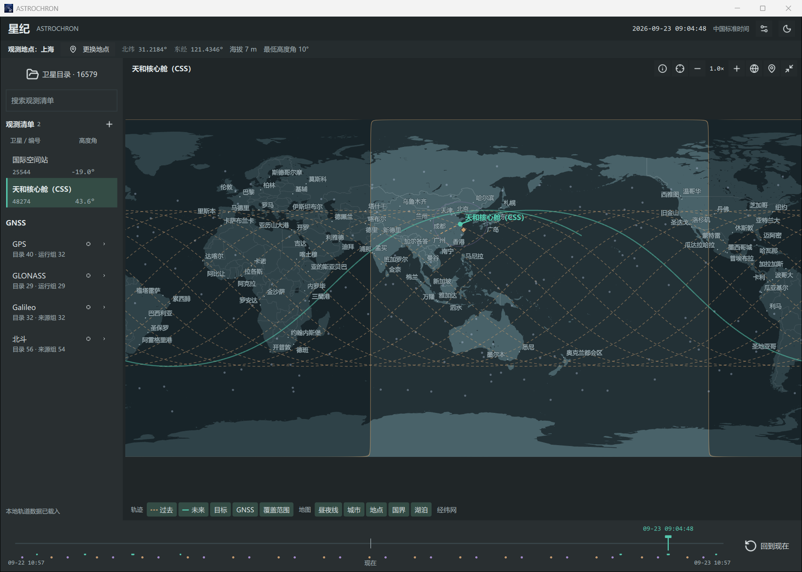
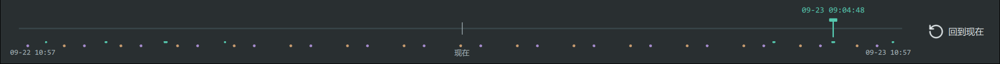
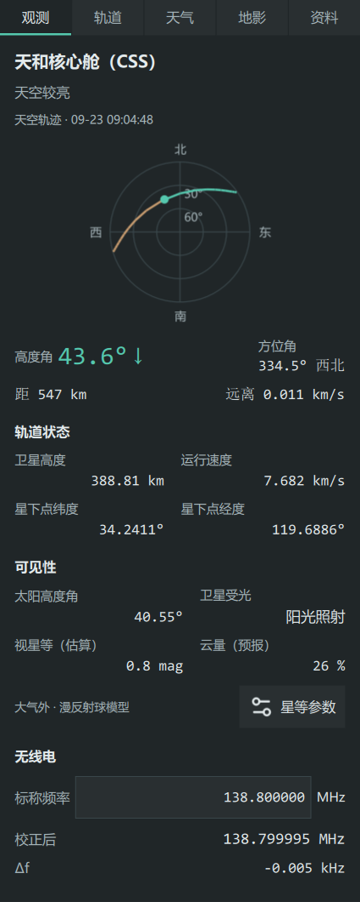

# User Guide

[简体中文](user-guide.md) | English

[Quick Start](../README.en.md#quick-start) · [Data Sources](data-sources.en.md) · [Calculation Notes](calculations.en.md)

## Selecting an Observing Location

Click "Change location" at the top of the main window and search for a city or enter a location name and coordinates. You can also click "Map location" on the map toolbar and select the observing position on the map

Confirm the altitude, minimum elevation, and time zone in the location dialog. Enable "Look up terrain elevation after selecting a location" to query the altitude by coordinates; for locations such as rooftops or observing platforms, you can enter it manually

Click "Save location" to retain the current settings and select them from "Saved locations" next time. Click "OK" to return to the main window

## Watchlist and Satellite Catalog

The watchlist stores frequently used targets. The search box in the left sidebar filters satellites in the list, and the angle on the right indicates each satellite's elevation at the selected time

Below each satellite, the list shows its next pass, peak elevation, and optical conditions within the 24 h following the selected time. Use the header to sort by "Watchlist order" or "Next pass"

Open "Satellite catalog" and search for a target by name, NORAD ID, international designator, or an available PRN. Check a satellite to add it to the watchlist, or uncheck it to remove it

GPS, GLONASS, Galileo, BeiDou, and Starlink are grouped by constellation. Expand a group to view its members, or click the preview button beside a constellation to view that group's satellites on the map

Constellation previews can show satellites currently at or above the minimum elevation, those with upcoming passes, or all positions. Upcoming passes cover the next 15 min; the full 24 h track is shown for the currently selected target

## Map

Use the mouse wheel or plus/minus buttons to zoom, drag to pan, and select "World view" to restore the full world map

Click "Follow satellite" or press F to set the map to 9× zoom and continuously follow the current target. You can continue zooming while following; click again or press F to restore the previous view

"Expand map" enlarges the map area, and "Collapse map" restores the pass table and details panel. Drag the dividers to resize the left and right sidebars; in narrower windows, use "Target details" to view the information from the right sidebar

Click the layer button below the map to toggle displayed content

| Layer | Displayed content |
| --- | --- |
| Past | Calculated track before the selected time, shown as an orange dashed line |
| Future | Calculated track after the selected time, shown as a cyan solid line |
| Objects | Positions of objects in the watchlist and current preview |
| GNSS | Positions of navigation satellites in the local catalog |
| Footprint | Ground coverage of the target satellite |
| Day/night | Sunlit and nighttime regions of Earth |
| Cities, Observer, Borders, Lakes, Graticule | Geographic reference layers |

## Timeline and Pass Predictions

In live mode, the time range covers 12 h before and after the current time. Drag the timeline to view target positions at the selected time, and click "Back to now" to resume live mode

The "Now" tick on the timeline marks the actual time, while the draggable time cursor marks the time being viewed. Hover over a pass interval or an eclipse event marker to view its time; click a marker to jump to the corresponding pass culmination or event time

Compare start times, maximum elevations, durations, and optical conditions in the pass table. Click a pass row to view its culmination, then drag the timeline to examine the entire pass

See [Calculation Notes](calculations.en.md#passes-and-optical-conditions) for how pass boundaries and optical conditions are determined

Click "Export observation plan" beside the pass table or press Ctrl+E to view passes for the current target within the 12 h following the selected time. Choose "Export CSV" or "Export ICS" to save them

CSV files can be opened in spreadsheet software, and ICS files can be imported into calendars. Event times are saved in UTC; descriptions include the observing location's time zone, local times, culmination, and orbital epoch

## Observation Information

After selecting a target, open the "Observe" tab on the right. The sky chart and main values at the top change with the selected time; scroll down to view orbital state, visibility, and radio information

See [Calculation Notes](calculations.en.md) for the definitions and calculation methods of these values

## Setting Magnitude Parameters

View apparent magnitude in the "Observe" tab, and click "Magnitude settings" to manage the parameters used for the current satellite

Enter the reference magnitude, reference phase angle, source, and source date. Confirm that the values correspond to the form's reference range of 1000 km, then click "Save". Choose full phase at 0° or half phase at 90° according to the source

Click "Import catalog" and select a QuickSat `.mag` file. You can enter the publication date or observation cutoff date stated by the source, then click "Import"

Click "Use default" to use the corresponding bundled value. The source and date currently in use are shown in the "Sources" tab

See [Magnitude Data](data-sources.en.md#magnitude-data) for sources and their order of precedence, and [Apparent Magnitude](calculations.en.md#apparent-magnitude) for the estimation method and influencing factors

## Radio

Enter the nominal frequency in MHz in the "Radio" section. The application displays the Doppler shift and corrected receiving frequency

Drag the timeline to view changes in receiving frequency throughout a pass

## Orbits and Sources

In "Satellite catalog", click "Import orbit file" and select a TLE text file (`.tle` / `.txt`) or an OMM JSON file (`.json`). To retrieve online data, select a source group and click the update button

After selecting a satellite, view its full orbital elements in the "Orbit" tab. Use the buttons at the top to copy the parameters or save orbital JSON

View sources and dates in the "Sources" tab and select a saved orbital snapshot using "Acquisition time". The map and observation information are recalculated using the selected elements

Click the pin button to retain the current snapshot indefinitely. In settings, click "Review older snapshots" to pin important data before enabling automatic cleanup. The latest 5 or 10 snapshots can be retained for each online data group; pinned records and local imports are retained indefinitely

See [Data Sources](data-sources.en.md) for download intervals, catalog counts, and local storage locations

## Weather and Settings

Select "简体中文", "English", or "System default" in settings to switch the interface language. You can also choose a language in the location dialog on first launch

Open the "Weather" tab to view the forecast for the selected location and time. Click "Refresh weather" to query it again

In settings, "Fetch observing weather" controls weather queries. "Map refresh rate" can be set from 1–60 Hz, and "Orbit calculation rate" controls updates to positions and observation values, up to the map refresh rate. Both default to 1 Hz

The moon icon at the top switches between dark and light interfaces

Click "Check for updates" in settings to query GitHub releases. "Include pre-release versions" controls whether versions such as preview releases are included. When an update is found, you can view its notes and click "Open release page" to choose a download

## Keyboard Controls

| Shortcut | Action |
| --- | --- |
| Ctrl+F | Search the watchlist |
| Ctrl+O | Import an orbit file |
| Ctrl+E | Export an observation plan |
| Ctrl+, | Open settings |
| F | Follow the target / restore the previous view |
| + / − | Zoom the map, using the main keyboard or numeric keypad |
| Space | Expand / collapse the map |
| Esc | Exit map location selection or collapse the map |

Text fields retain text input; when a dialog is open, it receives keyboard input
