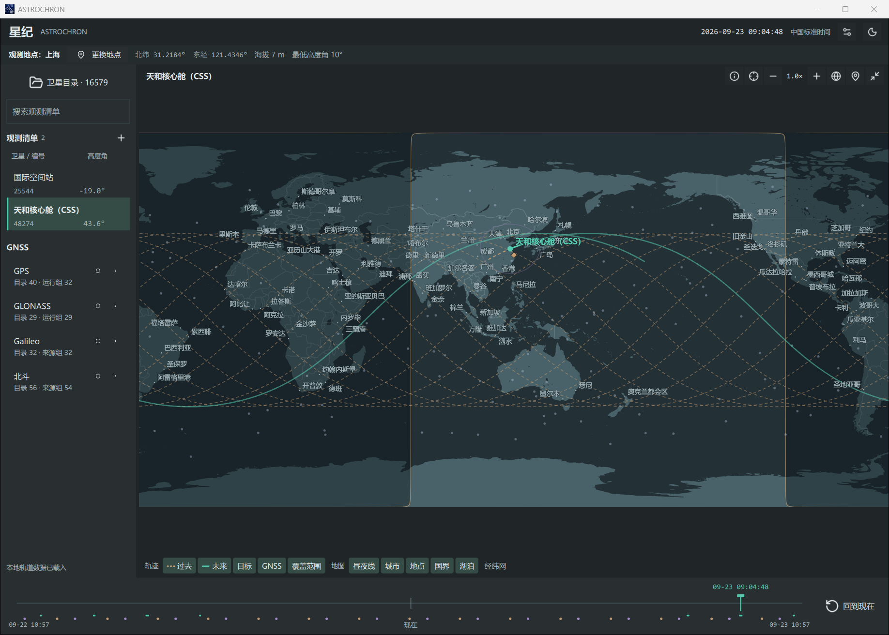
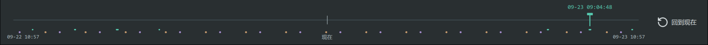
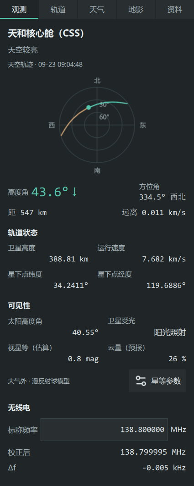

# 使用手册

[快速开始](../README.md#快速开始) · [数据来源](data-sources.md) · [计算说明](calculations.md)

## 选择观测地点

点击主界面顶部的“更换地点”，搜索城市或填写地点名称与经纬度；也可点击地图工具栏的“地图选点”，再点选观测位置

在地点窗口中确认海拔、最低高度角与时区，启用“选点后自动查询地形海拔”可按坐标查询海拔，楼顶、观测台等位置可手动填写

点击“保存为常用地点”保留当前设置，下次在“常用地点”中选择，点击“确定”返回主界面

## 观测清单与卫星目录

观测清单保存常用目标，左栏搜索框筛选清单中的卫星，右侧角度表示该卫星在所选时刻的高度角

打开“卫星目录”，按名称、NORAD ID、国际编号或已有 PRN 搜索目标，勾选卫星即可加入观测清单，取消勾选即可移出

GPS、GLONASS、伽利略、北斗与 Starlink 按星座分组，展开分组可查看具体成员，点击星座旁的预览按钮可在地图上查看该组卫星

星座预览可选择当前达到最低高度角、即将过境或全部位置，其中即将过境范围为未来 15 min，完整 24 h 轨迹随当前选中目标显示

## 地图

滚轮或加减按钮可缩放地图，拖动可平移，“全球视图”恢复完整世界地图，“跟随卫星”将视图中心保持在目标附近

“展开地图”扩大地图显示区域，“收起地图”恢复过境表和详情栏；左右栏可拖动分隔处改变宽度，较窄窗口通过“目标详情”查看右侧信息

点击地图下方的图层按钮可切换显示内容

| 图层 | 显示内容 |
| --- | --- |
| 过去 | 所选时刻之前的推算轨迹，橙色虚线 |
| 未来 | 所选时刻之后的推算轨迹，青色实线 |
| 目标 | 观测清单与当前预览对象的位置 |
| GNSS | 本地目录中的导航卫星位置 |
| 覆盖范围 | 目标卫星的地面覆盖范围 |
| 昼夜线 | 地球日照与夜间区域 |
| 城市、地点、国界、湖泊、经纬网 | 地理参照图层 |

## 时间轴与过境预报

实时状态下，时间范围覆盖当前时刻前后各 12 h；拖动后以所选时刻查看目标位置，点击“回到现在”恢复实时状态

时间轴上的“现在”刻线标出真实时间，可拖动的时间指针标出正在查看的时间；将鼠标停在过境区间或地影事件标记上可查看时间，点击标记可跳到对应的过境最高点或事件时刻

在过境表中比较开始时刻、最高高度角、持续时间与光学条件，点击过境行可查看最高点，随后拖动时间轴查看整次过境

过境起止与光学条件的判定见[计算说明](calculations.md#过境与光学条件)

## 观测信息

选择目标后打开右侧“观测”页，顶部天空图和主要数值随所选时刻变化，向下可查看轨道状态、可见性和无线电信息

各项数值的定义与计算方法见[计算说明](calculations.md)

## 设置星等参数

在“观测”页查看视星等，点击“星等参数”可管理当前卫星使用的参数

填写参考星等、参考相位角、来源与资料日期，确认数值对应表单中的 1000 km 参考距离后点击“保存”，相位角按资料选择满相 0° 或半相 90°

点击“导入星等表”并选择 QuickSat `.mag` 文件，可填写来源标明的发布日期或观测截止日期，再点击“导入”

点击“恢复默认”可使用对应的内置值，当前采用的来源和日期在“资料”页查看

资料来源与采用顺序见[星等资料](data-sources.md#星等资料)，估算方法与影响因素见[视星等计算](calculations.md#视星等)

## 无线电

在“无线电”区域填写标称频率，单位 MHz，程序显示多普勒频移与校正后的接收频率

拖动时间轴可查看整次过境中的接收频率变化

## 轨道与资料

在“卫星目录”中点击“导入轨道文件”，选择 TLE 文本（`.tle` / `.txt`）或 OMM JSON（`.json`）文件；获取在线资料时，选择来源分组并点击更新按钮

选择卫星后，在“轨道”页查看完整轨道根数，使用顶部按钮复制参数或保存轨道 JSON

在“资料”页查看来源与日期，通过“本地获取时间”选择已保存的轨道快照，地图与观测信息会按所选根数重新计算

下载间隔、目录数量与本地保存位置见[数据来源](data-sources.md)

## 天气与设置

在设置中选择“简体中文”“English”或“跟随系统”，界面随选择切换；首次启动时也可在地点窗口选择语言

打开“天气”页查看所选地点和时刻的预报，点击“更新天气”可重新查询

设置中的“获取观测天气预报”控制天气查询，“实时更新频率”可在 1–60 Hz 之间选择，默认 1 Hz，用于控制位置与观测数据的刷新

顶部月亮图标切换深色和浅色界面
